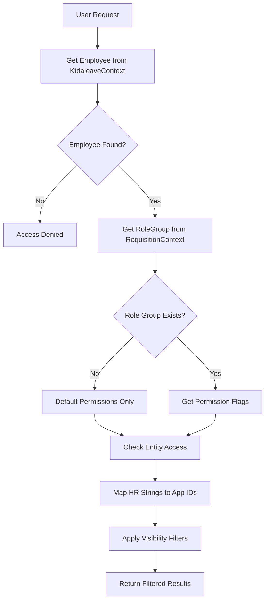

# Role Group Authorization System - Master Reference

## Overview

The MRIV (Material Requisition and Inventory Verification) system implements a sophisticated hierarchical authorization system that controls data access based on organizational structure and flexible role groups. This document serves as the master reference for understanding, implementing, and maintaining the authorization system.

## System Architecture

### Database Context Integration

The MRIV authorization system operates across **two separate database contexts**:

1. **KtdaleaveContext** (HR System)
   - `Employee_bkp`: Employee master data with string-based org references
   - `Department`: Department master with `departmentCode` (PK) and `DepartmentID` (business code)
   - `Station`: Station master with `StationID` and `Station_Name`
   - **No foreign key constraints** between tables

2. **RequisitionContext** (MRIV Application)
   - `RoleGroups`: Authorization permission definitions
   - `RoleGroupMembers`: User-to-role assignments by PayrollNo
   - `Requisitions`: Business entities with integer-based IDs
   - `MaterialAssignments`: Location tracking with StationId/DepartmentId

### Core Components

1. **Organizational Hierarchy** (Cross-Context)
   ```csharp
   // HR Context (string-based)
   Employee_bkp.Station = "HQ"          // Station name/code
   Employee_bkp.Department = "101"       // Department code
   
   // App Context (ID-based) 
   Requisition.IssueStationId = 1        // Integer FK
   MaterialAssignment.DepartmentId = 395 // Integer FK
   ```

2. **Role Group System** (RequisitionContext)
   - `RoleGroup` entities with boolean permission flags
   - `RoleGroupMember` assignments linking PayrollNo to roles
   - Dynamic permission evaluation across contexts

3. **Authorization Service** (Integration Layer)
   - `VisibilityAuthorizeService`: Core implementation with cross-context logic
   - Query filtering handling string-to-ID mapping
   - Entity access control with defensive null checks

## Authorization Decision Matrix

### Permission Flags

The system uses two critical boolean flags to determine access scope:

| Flag | Description | Impact |
|------|-------------|---------|
| `CanAccessAcrossStations` | User can access their department's data across ALL stations | Horizontal expansion of access |
| `CanAccessAcrossDepartments` | User can access ALL departments' data within their station scope | Vertical expansion of access |

### Complete Authorization Matrix

| User Type | CanAccessAcrossStations | CanAccessAcrossDepartments | Access Scope | Use Cases |
|-----------|:-----------------------:|:--------------------------:|--------------|-----------|
| **Default User** (no role group) | ❌ NO | ❌ NO | Own department at own station | Regular employees, contractors, no RoleGroupMember record |
| **Department Manager** | ❌ NO | ❌ NO | Own department at own station | Department heads, supervisors |
| **Station Support/Manager** | ❌ NO | ✅ YES | All departments at own station | Factory managers, station IT support |
| **Group/General Manager** | ✅ YES | ❌ NO | Own department at all stations | Regional managers, departmental GMs |
| **Administrator** | ✅ YES | ✅ YES | All data everywhere | System admins, super users |

## Decision Flow Logic

### Cross-Context Authorization Flow



### Critical Integration Challenges

#### **1. Data Mapping Requirements**
```csharp
// Employee data comes from HR system (string-based)
var employee = await _ktdaContext.EmployeeBkps
    .FirstOrDefaultAsync(e => e.PayrollNo == "HGD00032");
// employee.Station = "HQ", employee.Department = "101"

// Authorization requires ID-based matching
var stationId = await MapStationNameToId(employee.Station);   // "HQ" → ?
var departmentId = await MapDepartmentCodeToId(employee.Department); // "101" → 396

// Apply to business entity filtering
var visibleRequisitions = _context.Requisitions
    .Where(r => r.IssueStationId == stationId || r.DeliveryStationId == stationId);
```

#### **2. Missing Referential Integrity**
- No foreign keys between Employee_bkp and Department/Station tables
- String-based relationships require defensive programming
- Potential for orphaned references and data inconsistencies

#### **3. Naming Convention Inconsistencies**
| Context | Station Reference | Department Reference |
|---------|------------------|---------------------|
| KtdaleaveContext | `Station_Name` (varchar) | `DepartmentID` (varchar) |
| RequisitionContext | `StationId` (int) | `DepartmentId` (int) |
| Employee_bkp | `Station` (varchar) | `Department` (varchar) |

### Real-World Data Patterns (Based on Database Analysis)

#### **Employee Data Patterns**
```sql
-- Sample Employee_bkp records showing actual data patterns
PayrollNo    Station    Department    Role           Hod         supervisor
'HGD00032'   'HQ'       'HGD'        'user'         NULL        NULL
'HAM00000'   'HQ'       '101'        'user'         NULL        NULL  
'HHE00052'   '005'      'HHE'        'FieldUser'    NULL        NULL
'FAL02890'   '367'      '367'        'FieldUser'    'HGD03549'  NULL
```

#### **Department Master Data**
```sql
-- Department table showing ID mapping complexity
departmentCode  DepartmentID  DepartmentName                    DepartmentHD
395            '100'         'HEAD OFFICE'                     ''
396            '101'         'CHIEF EXECUTIVE'                 'SAP01892'
397            '102'         'CORPORATE SERVICES'              'SAP02152'
398            '103'         'INTERNAL AUDIT'                  'HGD04319'
```

#### **Station Master Data**
```sql
-- Station table showing naming patterns
StationID  Station_Name
1          'KAPSARA'
2          'NDUTI'  
3          'GACHEGE'
4          'GIANCHORE'
```

#### **Data Inconsistency Examples**
```sql
-- Employee references that don't map to master data
Employee.Station = 'HQ'     -- No matching Station.Station_Name
Employee.Station = '005'    -- Code-based, unclear mapping
Employee.Department = 'HGD' -- No matching Department.DepartmentID
Employee.Department = '367' -- May be both station and department
```

### Authorization Evaluation Process


### Detailed Logic Implementation

```csharp
IF user.Role == "Admin"
    RETURN GrantFullAccess()

var roleGroups = GetActiveRoleGroups(user.PayrollNo)
IF roleGroups.Empty()
    RETURN RestrictToOwnData()

var canAccessAcrossStations = roleGroups.Any(g => g.CanAccessAcrossStations)
var canAccessAcrossDepartments = roleGroups.Any(g => g.CanAccessAcrossDepartments)

SWITCH (canAccessAcrossStations, canAccessAcrossDepartments)
    CASE (false, false): RETURN RestrictToDepartmentAtStation()
    CASE (false, true):  RETURN RestrictToAllDepartmentsAtStation()
    CASE (true, false):  RETURN RestrictToDepartmentAtAllStations()
    CASE (true, true):   RETURN GrantFullAccess()
```

## Data Normalization Rules

### Station Code Normalization

| Input | Normalized Output | Description |
|-------|-------------------|-------------|
| "HQ" | "0" | Headquarters special case |
| "0" | "0" | Already normalized HQ |
| "1" | "001" | Single digit to 3-digit format |
| "12" | "012" | Two digit to 3-digit format |
| "123" | "123" | Already 3-digit format |

### Department Code Normalization

- Stored as integer values in database
- String representation with trimming applied
- Cross-context consistency between KtdaleaveContext and RequisitionContext

## Integration Points with System Modules

### 1. Requisition Management
- **Creation**: Filter available materials by user's access scope
- **Approval**: Show only requisitions user can approve
- **Status Updates**: Restrict updates based on visibility rules

### 2. Material Assignment
- **Assignment Creation**: Validate user can assign materials in target department/station
- **Transfer Requests**: Verify both source and destination access
- **Return Processing**: Confirm user can process returns for materials

### 3. Workflow Engine
- **Approval Queues**: Filter approvals by role group permissions
- **Notification Routing**: Send notifications only to authorized recipients
- **Escalation Logic**: Respect permission boundaries in escalation paths

### 4. Reporting System
- **Data Filtering**: Apply visibility scope to all reports
- **Dashboard Widgets**: Show only authorized data in widgets
- **Export Functions**: Restrict export data to user's scope

## Security Implications and Best Practices

### Security Considerations

#### ⚠️ **Critical Security Issues**

1. **Default Permission Values**
   ```csharp
   // SECURITY RISK: RoleGroup model defaults
   public bool CanAccessAcrossStations { get; set; } = true;  // ❌ TOO PERMISSIVE
   public bool CanAccessAcrossDepartments { get; set; } = true; // ❌ TOO PERMISSIVE
   ```
   **Recommendation**: Default to `false` for principle of least privilege

2. **Admin Bypass**
   - Admin role bypasses all role group restrictions
   - No audit trail for admin access decisions
   - Consider implementing admin justification logging

3. **Role Group Flag Logic**
   - ANY role group with flag=true grants permission (OR logic)
   - Could lead to privilege escalation if not carefully managed

#### ✅ **Security Best Practices**

1. **Regular Audits**
   - Monthly review of role group memberships
   - Quarterly validation of permission flag settings
   - Annual comprehensive access review

2. **Principle of Least Privilege**
   - Start with minimal permissions and expand as needed
   - Regular cleanup of inactive role group memberships
   - Time-bound role assignments where appropriate

3. **Monitoring and Logging**
   - Log all authorization decisions (currently missing)
   - Alert on suspicious access patterns
   - Track admin override usage

### Implementation Guidelines

#### Creating New Role Groups

```csharp
// ✅ CORRECT: Start with restrictive permissions
var newRoleGroup = new RoleGroup
{
    Name = "Department Supervisor",
    Description = "Supervises specific department operations",
    CanAccessAcrossStations = false,    // ✅ Restrictive by default
    CanAccessAcrossDepartments = false, // ✅ Restrictive by default
    IsActive = true
};
```

#### Adding Users to Role Groups

```csharp
// ✅ CORRECT: Validate business justification
var membership = new RoleGroupMember
{
    RoleGroupId = roleGroupId,
    PayrollNo = userPayrollNo,
    IsActive = true,
    CreatedAt = DateTime.Now
    // Consider adding: JustificationReason, ApprovedBy, ExpiryDate
};
```

## Performance Considerations

### Query Optimization

1. **Index Strategy**
   ```sql
   -- Critical indexes for performance
   CREATE INDEX IX_RoleGroupMembers_PayrollNo_IsActive ON RoleGroupMembers (PayrollNo, IsActive);
   CREATE INDEX IX_RoleGroups_IsActive ON RoleGroups (IsActive);
   CREATE INDEX IX_MaterialAssignments_PayrollNo_IsActive ON MaterialAssignments (PayrollNo, IsActive);
   ```

2. **Caching Strategy**
   - Cache user role group memberships (TTL: 15 minutes)
   - Cache department/station lookups (TTL: 1 hour)
   - Invalidate cache on role group changes

3. **Query Pattern Optimization**
   ```csharp
   // ✅ EFFICIENT: Single query with joins
   var authorizedRequisitions = context.Requisitions
       .Where(r => authorizedDepartments.Contains(r.DepartmentId))
       .Where(r => authorizedStations.Contains(r.IssueStationId));
   
   // ❌ INEFFICIENT: Multiple database calls
   foreach (var requisition in allRequisitions)
   {
       if (await CanUserAccessAsync(requisition, userPayrollNo)) // DB call per item
       {
           // Process requisition
       }
   }
   ```

## Common Pitfalls and Solutions

### Pitfall 1: Cross-Context Data Inconsistency

**Problem**: Employee data in KtdaleaveContext doesn't match RequisitionContext expectations

**Solution**:
```csharp
// Implement cross-context validation
public async Task<bool> ValidateEmployeeDataConsistency(string payrollNo)
{
    var ktdaEmployee = await _ktdaleaveContext.EmployeeBkps
        .FirstOrDefaultAsync(e => e.PayrollNo == payrollNo);
    
    var requisitionEmployee = await _requisitionContext.Employees
        .FirstOrDefaultAsync(e => e.PayrollNo == payrollNo);
    
    return ktdaEmployee?.Department == requisitionEmployee?.Department &&
           ktdaEmployee?.Station == requisitionEmployee?.Station;
}
```

### Pitfall 2: Forgotten Permission Updates

**Problem**: New features don't implement authorization checks

**Solution**: Implement authorization checklist for code reviews
```csharp
// Template for new controller actions
[HttpGet]
public async Task<IActionResult> NewFeature()
{
    // ✅ REQUIRED: Apply authorization filtering
    var authorizedData = await _visibilityService
        .ApplyVisibilityScopeAsync(query, User.Identity.Name);
    
    return View(authorizedData);
}
```

### Pitfall 3: Testing Without Proper Data Setup

**Problem**: Tests pass with admin users but fail with restricted users

**Solution**: Use standardized test data (see AuthorizationTestMatrix.md)

## Backward Compatibility Considerations

### Database Schema Changes

1. **Adding New Permission Flags**
   ```sql
   -- Add new permission with safe default
   ALTER TABLE RoleGroups 
   ADD CanAccessAcrossProjects BIT DEFAULT 0; -- ✅ Restrictive default
   ```

2. **Changing Default Values**
   ```sql
   -- Update existing records first, then change default
   UPDATE RoleGroups 
   SET CanAccessAcrossStations = 0 
   WHERE CanAccessAcrossStations = 1 AND Name != 'Administrator';
   
   ALTER TABLE RoleGroups 
   ALTER COLUMN CanAccessAcrossStations BIT DEFAULT 0;
   ```

### Code Migration Patterns

```csharp
// Version compatibility wrapper
public async Task<bool> HasPermissionAsync(string payrollNo, string permission)
{
    // Support both old and new permission systems
    if (await IsLegacyUser(payrollNo))
    {
        return await CheckLegacyPermission(payrollNo, permission);
    }
    
    return await CheckRoleGroupPermission(payrollNo, permission);
}
```

## Troubleshooting Common Issues

### Issue 1: User Can't See Expected Data

**Diagnostic Steps**:
1. Verify user's role group membership: `SELECT * FROM RoleGroupMembers WHERE PayrollNo = 'XXX' AND IsActive = 1`
2. Check role group permissions: `SELECT * FROM RoleGroups WHERE Id IN (...)`
3. Validate user's department/station: `SELECT Department, Station FROM EmployeeBkp WHERE PayrollNo = 'XXX'`
4. Test authorization logic in isolation

**Common Causes**:
- Inactive role group membership
- Incorrect department/station assignment
- Role group with insufficient permissions
- Data normalization mismatches

### Issue 2: Performance Degradation

**Diagnostic Steps**:
1. Check query execution plans
2. Validate index usage
3. Monitor cache hit rates
4. Profile authorization service calls

**Optimization Strategies**:
- Batch authorization checks
- Implement result caching
- Use projection queries to reduce data transfer
- Consider denormalization for frequently accessed data

## Related Documentation

- [VisibilityAuthorizeService Reference](../Services/VisibilityAuthorizeService_Reference.md) - Detailed service documentation
- [Authorization Test Matrix](../Testing/AuthorizationTestMatrix.md) - Comprehensive testing scenarios
- [Permission Matrix Quick Reference](../QuickReference/PermissionMatrix_QuickRef.md) - One-page reference
- [Extending Authorization](../Development/ExtendingAuthorization.md) - Developer implementation guide
- [Role Group Management](../Operations/RoleGroupManagement.md) - Administrative procedures

## Version History

| Version | Date | Changes | Author |
|---------|------|---------|--------|
| 1.0 | 2024-12 | Initial comprehensive documentation | System |
| | | | |

---

*This document should be reviewed quarterly and updated whenever authorization logic changes are made.*