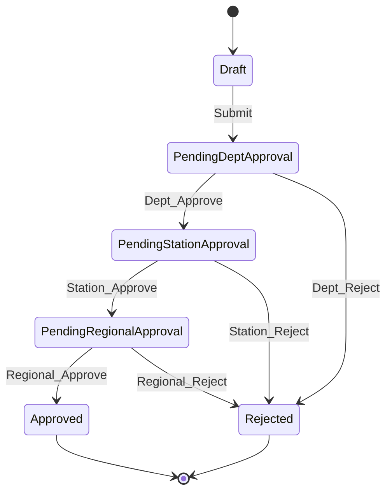

# Workflow Authorization Integration

## Overview
This document details how the role group authorization system integrates with MRIV business workflows. It covers requisition approval flows, material assignment processes, and cross-departmental operations.

---

## Requisition Workflow Authorization

### Requisition Creation
```csharp
// Authorization checks during requisition creation
public async Task<bool> CanCreateRequisition(Employee user, RequisitionRequest request)
{
    // 1. User must be able to access the requesting department
    if (!_visibilityService.CanUserAccessEntity(
        request.RequestingStationId, 
        request.RequestingDepartmentId, 
        user))
    {
        return false;
    }
    
    // 2. User must be able to create requisitions for target department
    if (request.RequestingDepartmentId != user.DepartmentId && 
        !user.RoleGroup.CanAccessAcrossDepartments)
    {
        return false;
    }
    
    return true;
}
```

### Approval Chain Authorization

#### Level 1: Departmental Approval
- **Required Permission**: Access to requisition's department
- **Logic**: Approver must have `CanAccessAcrossDepartments = true` OR be in same department
- **Bypass Condition**: None

#### Level 2: Station Management Approval
- **Required Permission**: Access across departments within station
- **Logic**: Approver must have `CanAccessAcrossDepartments = true` AND same station access
- **Bypass Condition**: If approver has `CanAccessAcrossStations = true`

#### Level 3: Regional/System Approval
- **Required Permission**: Cross-station access
- **Logic**: Approver must have `CanAccessAcrossStations = true`
- **Bypass Condition**: None (highest level)

### Workflow State Transitions



### Authorization Rules by State

| State | Who Can View | Who Can Edit | Who Can Approve |
|-------|--------------|--------------|-----------------|
| **Draft** | Creator + Manager hierarchy | Creator | N/A |
| **PendingDeptApproval** | Dept + Station + Regional | Creator (limited) | Department approvers |
| **PendingStationApproval** | Station + Regional | System only | Station approvers |
| **PendingRegionalApproval** | Regional approvers | System only | Regional approvers |
| **Approved** | All with entity access | System only | N/A |
| **Rejected** | All with entity access | None | N/A |

---

## Material Assignment Authorization

### Assignment Creation Flow
```csharp
public async Task<AuthorizationResult> AuthorizeMaterialAssignment(
    Employee assignor, 
    MaterialAssignment assignment)
{
    var result = new AuthorizationResult();
    
    // 1. Can assignor access the target employee's department?
    if (!_visibilityService.CanUserAccessEntity(
        assignment.Employee.StationId,
        assignment.Employee.DepartmentId,
        assignor))
    {
        result.AddError("Cannot assign materials to employees in inaccessible departments");
        return result;
    }
    
    // 2. Can assignor access the material's current location?
    if (!_visibilityService.CanUserAccessEntity(
        assignment.Material.CurrentStationId,
        assignment.Material.CurrentDepartmentId,
        assignor))
    {
        result.AddError("Cannot assign materials from inaccessible locations");
        return result;
    }
    
    // 3. Cross-station assignment requires special permission
    if (assignment.Employee.StationId != assignment.Material.CurrentStationId &&
        !assignor.RoleGroup.CanAccessAcrossStations)
    {
        result.AddError("Cross-station assignments require station-level access");
        return result;
    }
    
    result.IsAuthorized = true;
    return result;
}
```

### Material Movement Workflow

#### Internal Department Movement
- **Permission Required**: None (same department)
- **Validation**: Assignor and target in same department
- **Approval**: Automatic

#### Cross-Department Movement (Same Station)
- **Permission Required**: `CanAccessAcrossDepartments = true`
- **Validation**: Both departments within assignor's station access
- **Approval**: Department manager approval may be required

#### Cross-Station Movement
- **Permission Required**: `CanAccessAcrossStations = true`
- **Validation**: Full system access verification
- **Approval**: Station manager + receiving station approval required

---

## Cross-Context Authorization

### KtdaleaveContext Integration
The MRIV system integrates with the leave management system for employee availability checks.

```csharp
public async Task<bool> IsEmployeeAvailableForAssignment(
    string payrollNo, 
    DateTime assignmentDate,
    Employee requestor)
{
    // 1. Check if requestor can access employee data
    var employee = await _context.Employees
        .FirstOrDefaultAsync(e => e.PayrollNo == payrollNo);
    
    if (!_visibilityService.CanUserAccessEntity(
        employee.StationId, 
        employee.DepartmentId, 
        requestor))
    {
        throw new UnauthorizedAccessException("Cannot check availability for inaccessible employee");
    }
    
    // 2. Query leave system (separate context)
    using var leaveContext = new KtdaleaveContext();
    var hasLeave = await leaveContext.LeaveApplications
        .AnyAsync(la => la.PayrollNo == payrollNo && 
                       la.StartDate <= assignmentDate && 
                       la.EndDate >= assignmentDate &&
                       la.Status == "Approved");
    
    return !hasLeave;
}
```

---

## Approval Authority Matrix

### Department Level Approvals
| Action | Single Dept User | Cross-Dept User | Station Manager | System Admin |
|--------|------------------|------------------|-----------------|--------------|
| Own Dept Requisitions | ❌ View Only | ✅ Approve | ✅ Approve | ✅ Approve |
| Other Dept Requisitions | ❌ No Access | ✅ Approve | ✅ Approve | ✅ Approve |
| Cross-Station Requisitions | ❌ No Access | ❌ View Only | ❌ View Only | ✅ Approve |

### Material Assignment Approvals
| Assignment Type | Required Permission | Auto-Approve | Manual Approval |
|----------------|-------------------|--------------|-----------------|
| Same Employee | None | ✅ | N/A |
| Same Department | Dept Access | ✅ | N/A |
| Cross Department | Cross-Dept Access | ❌ | Dept Manager |
| Cross Station | Cross-Station Access | ❌ | Station + Regional |

---

## Workflow Business Rules

### Requisition Validation Rules
1. **Creator Visibility**: Creator must have visibility to requesting department
2. **Approver Chain**: Each approver must have appropriate permission level
3. **Material Availability**: System validates material stock against user's accessible inventory
4. **Budget Constraints**: Budget checks limited to user's accessible cost centers

### Assignment Validation Rules
1. **Employee Accessibility**: Target employee must be within assignor's access scope
2. **Material Accessibility**: Source material must be within assignor's access scope  
3. **Location Constraints**: Cross-location moves require appropriate permissions
4. **Availability Checks**: Employee availability verified within permission scope

### Approval Validation Rules
1. **Authority Level**: Approver must have required authority for approval level
2. **Conflict of Interest**: Approvers cannot approve their own requests
3. **Delegation**: Approval delegation must maintain permission requirements
4. **Audit Trail**: All approvals logged with authorization context

---

## Exception Handling

### Permission Elevation Requests
```csharp
public async Task<ElevationResult> RequestPermissionElevation(
    Employee user, 
    string action, 
    string justification)
{
    var elevationRequest = new PermissionElevationRequest
    {
        RequestorPayrollNo = user.PayrollNo,
        RequestedAction = action,
        Justification = justification,
        RequestDate = DateTime.UtcNow,
        Status = "Pending"
    };
    
    // Route to appropriate approver based on elevation needed
    var requiredApprover = DetermineElevationApprover(action, user);
    elevationRequest.ApproverPayrollNo = requiredApprover;
    
    await _context.PermissionElevationRequests.AddAsync(elevationRequest);
    await _context.SaveChangesAsync();
    
    // Notify approver
    await NotifyElevationApprover(elevationRequest);
    
    return new ElevationResult { RequestId = elevationRequest.Id };
}
```

### Emergency Access Protocols
- **Emergency Override**: System admin can grant temporary elevated permissions
- **Audit Requirement**: All emergency access must be justified and logged
- **Time Limits**: Emergency permissions expire automatically after set period
- **Review Process**: Emergency access reviewed in next audit cycle

---

## Performance Optimization

### Caching Strategies
```csharp
// Cache approval authority for session duration
public async Task<ApprovalAuthority> GetCachedApprovalAuthority(string payrollNo)
{
    var cacheKey = $"approval_authority_{payrollNo}";
    
    if (_cache.TryGetValue(cacheKey, out ApprovalAuthority authority))
    {
        return authority;
    }
    
    authority = await CalculateApprovalAuthority(payrollNo);
    
    _cache.Set(cacheKey, authority, TimeSpan.FromMinutes(30));
    
    return authority;
}
```

### Query Optimization
- **Eager Loading**: Pre-load approval chains with permission context
- **Filtered Queries**: Apply authorization filters before workflow queries
- **Batch Processing**: Process multiple workflow items with single authorization check

---

## Integration Points

### External Systems
1. **Leave Management**: Employee availability validation
2. **Budget System**: Cost center authorization
3. **Inventory System**: Stock visibility based on permissions
4. **Notification System**: Approval routing based on authority

### API Endpoints
- `POST /api/workflows/requisitions/create` - Authorization embedded in creation logic
- `PUT /api/workflows/requisitions/{id}/approve` - Approval authority validation
- `POST /api/workflows/materials/assign` - Assignment permission validation
- `GET /api/workflows/pending-approvals` - Filtered by user's approval authority

---

## Error Scenarios and Handling

### Common Authorization Failures
1. **Insufficient Permissions**: Clear error messages with required permission level
2. **Invalid Approval Chain**: Detailed explanation of proper approval flow
3. **Cross-Context Conflicts**: Resolution steps for context integration issues
4. **Temporary Access Issues**: Guidance for elevation requests

### Recovery Mechanisms
- **Permission Refresh**: Force reload of user permissions
- **Workflow Reset**: Return workflow to previous valid state
- **Manual Override**: Admin intervention for critical issues
- **Audit Correction**: Post-action audit trail updates

---

*Related Documentation:*
- *[RoleGroupAuthorizationSystem.md](../Authorization/RoleGroupAuthorizationSystem.md) - Core authorization concepts*
- *[VisibilityAuthorizeService_Reference.md](../Services/VisibilityAuthorizeService_Reference.md) - Service implementation details*
- *[EntityVisibilityMatrix.md](EntityVisibilityMatrix.md) - Entity-specific visibility rules*