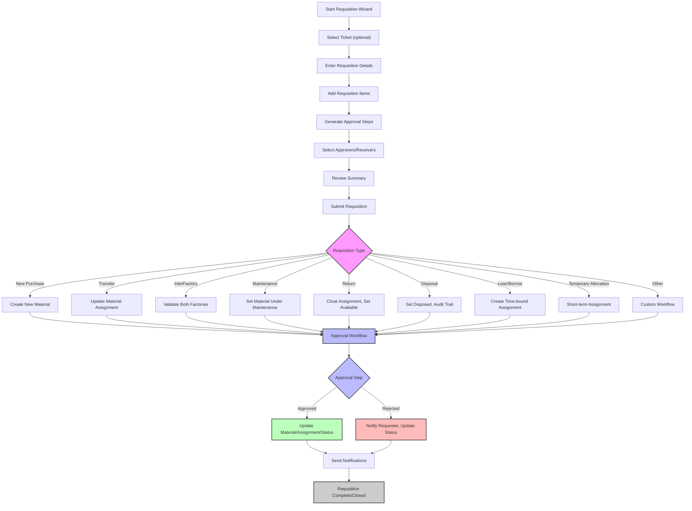

# Requisition Process Flow Diagram

This diagram visualizes the step-by-step flow of the requisition process, including wizard steps, branching by requisition type, and integration with approval and material logic.

