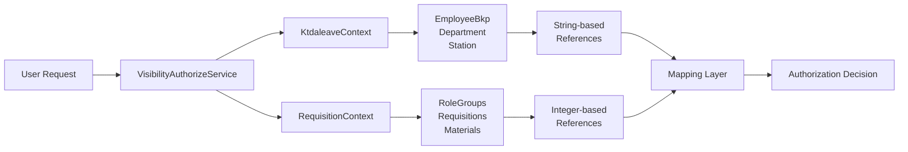

# VisibilityAuthorizeService Complete Reference

## Overview

The `VisibilityAuthorizeService` is the core component responsible for implementing **cross-context** role-based data access control in the MRIV system. This service integrates data from both `KtdaleaveContext` (HR system) and `RequisitionContext` (application database) to provide query filtering and entity access validation.

### Cross-Context Architecture



### Key Integration Challenges

1. **Data Context Separation**: Employee data (KtdaleaveContext) separate from authorization data (RequisitionContext)
2. **String-to-ID Mapping**: Employee references use strings ("HQ", "101") while business entities use integers
3. **No Foreign Key Integrity**: Relationships maintained through string matching with potential orphaned references
4. **Defensive Programming**: Must handle missing mappings and data inconsistencies gracefully

## Service Interface

```csharp
public interface IVisibilityAuthorizeService
{
    Task<IQueryable<T>> ApplyVisibilityScopeAsync<T>(IQueryable<T> query, string userPayrollNo) where T : class;
    Task<bool> CanUserAccessEntityAsync<T>(T entity, string userPayrollNo) where T : class;
    Task<bool> UserHasRoleForStep(int? stepConfigId, string userRole);
    Task<bool> ShouldRestrictToPayrollAsync(int? stepConfigId);
    Task<List<Department>> GetVisibleDepartmentsAsync(string userPayrollNo);
    Task<List<Station>> GetVisibleStationsAsync(string userPayrollNo);
}
```

## Method Documentation

### 1. ApplyVisibilityScopeAsync<T>

**Purpose**: Filters an IQueryable based on user's role group permissions

```csharp
Task<IQueryable<T>> ApplyVisibilityScopeAsync<T>(IQueryable<T> query, string userPayrollNo) where T : class
```

#### Parameters
- `query`: The source queryable to filter
- `userPayrollNo`: User's payroll number for permission evaluation

#### Return Value
- Filtered queryable respecting user's access scope
- Empty queryable if user has no access

#### Supported Entity Types (Cross-Context)

**RequisitionContext Entities**:
- `Requisition` - Filtered by `DepartmentId` and station IDs (`IssueStationId`, `DeliveryStationId`)
- `Approval` - Filtered by requisition department and approval station
- `MaterialAssignment` - Filtered by assignment `StationId`/`DepartmentId`

**KtdaleaveContext Entities**:
- `EmployeeBkp` - Filtered by string-based `Station` and `Department` fields

**Cross-Context Mapping Requirements**:
```csharp
// HR System (strings) → App System (integers)
Employee.Station = "HQ"           → StationId = ?
Employee.Department = "101"        → DepartmentId = 396
Requisition.DepartmentId = 396    → "CHIEF EXECUTIVE" department
```

#### Usage Examples

```csharp
// Controller usage - filter requisitions (cross-context)
var userPayrollNo = User.FindFirst(ClaimTypes.Name)?.Value;
var userRequisitions = await _visibilityService
    .ApplyVisibilityScopeAsync(_context.Requisitions, userPayrollNo);

// Service handles:
// 1. Get EmployeeBkp from KtdaleaveContext
// 2. Get RoleGroup from RequisitionContext  
// 3. Map string department/station to integers
// 4. Apply visibility filters

var results = await userRequisitions.ToListAsync();

// Service layer usage - chain with additional filters
var filteredQuery = _context.Approvals
    .Where(a => a.Status == ApprovalStatus.Pending);

var authorizedApprovals = await _visibilityService
    .ApplyVisibilityScopeAsync(filteredQuery, currentUser);
```

#### Cross-Context Implementation Logic 

**Critical Implementation Requirements**:
```csharp
public async Task<IQueryable<T>> ApplyVisibilityScopeAsync<T>(IQueryable<T> query, string userPayrollNo)
{
    // Step 1: Get employee from HR context
    var employee = await _employeeService.GetEmployeeByPayrollAsync(userPayrollNo);
    if (employee == null) return query.Where(x => false); // No access
    
    // Step 2: Get role group from app context  
    var roleGroupMember = await _context.RoleGroupMembers
        .Include(m => m.RoleGroup)
        .FirstOrDefaultAsync(m => m.PayrollNo == userPayrollNo && m.IsActive);
    
    if (roleGroupMember == null)
    {
        // Default user - only own records
        return ApplyDefaultUserFilter(query, userPayrollNo);
    }
    
    // Step 3: Map HR strings to App integers
    var userStationId = await MapStationNameToId(employee.Station);
    var userDepartmentId = await MapDepartmentCodeToId(employee.Department);
    
    // Step 4: Apply role-based filtering
    return ApplyRoleBasedFilter(query, roleGroupMember.RoleGroup, userStationId, userDepartmentId);
}

private async Task<int> MapStationNameToId(string stationName)
{
    // Handle inconsistent station references
    var mapping = await _cache.GetOrSetAsync($"station_{stationName}", async () =>
    {
        var station = await _ktdaContext.Stations
            .FirstOrDefaultAsync(s => 
                s.Station_Name.Contains(stationName) || 
                stationName.Contains(s.Station_Name) ||
                // Handle code-based mappings
                (stationName == "HQ" && s.Station_Name.Contains("HEAD")) ||
                (stationName.All(char.IsDigit) && s.StationID.ToString() == stationName));
        
        return station?.StationID ?? 0; // 0 = no mapping found
    });
    
    return mapping;
}
```

**Entity-Specific Filtering**:

**Requisitions** (Cross-Context):
```csharp
// Requisitions use integer IDs that must be mapped from HR strings
public IQueryable<Requisition> ApplyRequisitionFilter(IQueryable<Requisition> query, 
    RoleGroup roleGroup, int userStationId, int userDepartmentId)
{
    if (roleGroup.CanAccessAcrossStations && roleGroup.CanAccessAcrossDepartments)
        return query; // Admin access
    
    return query.Where(r =>
        // Own requisitions always visible  
        r.PayrollNo == userPayrollNo ||
        // Role-based visibility
        ((!roleGroup.CanAccessAcrossDepartments || r.DepartmentId == userDepartmentId) &&
         (!roleGroup.CanAccessAcrossStations || 
          r.IssueStationId == userStationId || r.DeliveryStationId == userStationId))
    );
}
```

**Approvals**:
```csharp
// Default User (no role group)
approvals.Where(a => a.PayrollNo == userPayrollNo)

// Department at Station
approvals.Where(a => 
    a.DepartmentId.ToString() == userDept &&
    a.StationId.ToString() == userStation)

// All Departments at Station
approvals.Where(a => a.StationId.ToString() == userStation)

// Department at All Stations
approvals.Where(a => a.DepartmentId.ToString() == userDept)

// Admin - No filtering applied
return query;
```

### 2. CanUserAccessEntityAsync<T>

**Purpose**: Checks if a user can access a specific entity instance

```csharp
Task<bool> CanUserAccessEntityAsync<T>(T entity, string userPayrollNo) where T : class
```

#### Parameters
- `entity`: The specific entity instance to check
- `userPayrollNo`: User's payroll number

#### Return Value
- `true` if user can access the entity
- `false` if access is denied

#### Usage Examples

```csharp
// Before displaying entity details
var requisition = await _context.Requisitions.FindAsync(id);
if (!await _visibilityService.CanUserAccessEntityAsync(requisition, User.Identity.Name))
{
    return Forbid();
}

// Before processing entity updates
if (await _visibilityService.CanUserAccessEntityAsync(approval, currentUser))
{
    // Process approval
    approval.Status = ApprovalStatus.Approved;
    await _context.SaveChangesAsync();
}
```

### 3. GetVisibleDepartmentsAsync

**Purpose**: Returns list of departments user can access

```csharp
Task<List<Department>> GetVisibleDepartmentsAsync(string userPayrollNo)
```

#### Usage Examples

```csharp
// Populate dropdown lists
var availableDepartments = await _visibilityService
    .GetVisibleDepartmentsAsync(User.Identity.Name);

ViewBag.Departments = new SelectList(availableDepartments, "DepartmentCode", "DepartmentName");

// Filter report data
var reportData = await _context.ReportItems
    .Where(r => availableDepartments.Select(d => d.DepartmentCode).Contains(r.DepartmentId))
    .ToListAsync();
```

### 4. GetVisibleStationsAsync

**Purpose**: Returns list of stations user can access

```csharp
Task<List<Station>> GetVisibleStationsAsync(string userPayrollNo)
```

#### Usage Examples

```csharp
// Location selection in forms
var availableStations = await _visibilityService
    .GetVisibleStationsAsync(User.Identity.Name);

ViewBag.IssueStations = new SelectList(availableStations, "StationId", "StationName");

// Dashboard filtering
var stationIds = availableStations.Select(s => s.StationId).ToList();
var stationStats = await _context.Materials
    .Where(m => stationIds.Contains(m.StationId))
    .GroupBy(m => m.StationId)
    .Select(g => new { StationId = g.Key, Count = g.Count() })
    .ToListAsync();
```

### 5. UserHasRoleForStep

**Purpose**: Workflow integration - checks if user has required role for workflow step

```csharp
Task<bool> UserHasRoleForStep(int? stepConfigId, string userRole)
```

#### Parameters
- `stepConfigId`: Workflow step configuration ID
- `userRole`: User's role (e.g., "Admin", "Manager")

#### Usage Examples

```csharp
// Workflow step validation
var canApprove = await _visibilityService
    .UserHasRoleForStep(workflowStep.Id, currentUserRole);

if (canApprove)
{
    // Show approval buttons
    ViewBag.ShowApprovalActions = true;
}
```

### 6. ShouldRestrictToPayrollAsync

**Purpose**: Determines if workflow step should be restricted to specific payroll numbers

```csharp
Task<bool> ShouldRestrictToPayrollAsync(int? stepConfigId)
```

#### Usage Examples

```csharp
// Workflow queue filtering
var restrictToPayroll = await _visibilityService
    .ShouldRestrictToPayrollAsync(stepConfig.Id);

if (restrictToPayroll)
{
    approvals = approvals.Where(a => a.PayrollNo == User.Identity.Name);
}
```

## Extension Patterns for New Entity Types

### Adding Support for New Entities

To extend the service to support new entity types, follow this pattern:

```csharp
// In ApplyVisibilityScopeAsync method
if (typeof(T) == typeof(YourNewEntity))
{
    var entities = query.Cast<YourNewEntity>();
    
    if (!isInAnyGroup)
    {
        // Default user logic
        return entities.Where(e => e.CreatedByPayrollNo == userPayrollNo).Cast<T>();
    }
    
    if (!canAccessAcrossStations && !canAccessAcrossDepartments)
    {
        // Department at station logic
        return entities.Where(e => 
            NormalizeDepartment(e.DepartmentId.ToString()) == userDept &&
            NormalizeStation(e.StationId.ToString()) == userStation
        ).Cast<T>();
    }
    
    // Continue with other permission combinations...
}

// In CanUserAccessEntityAsync method
if (entity is YourNewEntity newEntity)
{
    if (!isInAnyGroup)
        return newEntity.CreatedByPayrollNo == userPayrollNo;
    
    if (!canAccessAcrossStations && !canAccessAcrossDepartments)
        return NormalizeDepartment(newEntity.DepartmentId.ToString()) == userDept && 
               NormalizeStation(newEntity.StationId.ToString()) == userStation;
    
    // Continue with other permission combinations...
}
```

### Requirements for New Entities

For an entity to be compatible with the authorization service, it should have:

1. **Department Association**: Property indicating which department owns/created the entity
2. **Station Association**: Property indicating which station the entity belongs to
3. **User Association**: Property linking the entity to a specific user (for default user filtering)

Example entity structure:
```csharp
public class AuthorizableEntity
{
    public int Id { get; set; }
    public int DepartmentId { get; set; }    // Required for department-based filtering
    public int StationId { get; set; }       // Required for station-based filtering
    public string CreatedByPayrollNo { get; set; } // Required for user-specific filtering
    
    // Other entity-specific properties...
}
```

## Performance Optimization Guidelines

### 1. Caching Strategy

```csharp
// Cache user role groups for better performance
private readonly IMemoryCache _cache;

private async Task<List<RoleGroup>> GetActiveRoleGroupsCachedAsync(string payrollNo)
{
    var cacheKey = $"user_rolegroups_{payrollNo}";
    
    if (_cache.TryGetValue(cacheKey, out List<RoleGroup> cachedGroups))
    {
        return cachedGroups;
    }
    
    var roleGroups = await GetActiveRoleGroupsAsync(payrollNo);
    
    _cache.Set(cacheKey, roleGroups, TimeSpan.FromMinutes(15));
    
    return roleGroups;
}
```

### 2. Query Optimization

```csharp
// ✅ GOOD: Single query with proper filtering
public async Task<List<Requisition>> GetUserRequisitionsOptimized(string userPayrollNo)
{
    var authorizedQuery = await _visibilityService
        .ApplyVisibilityScopeAsync(_context.Requisitions, userPayrollNo);
    
    return await authorizedQuery
        .Include(r => r.Department)
        .Include(r => r.RequisitionItems)
        .OrderByDescending(r => r.CreatedAt)
        .ToListAsync();
}

// ❌ BAD: Multiple database calls
public async Task<List<Requisition>> GetUserRequisitionsInefficient(string userPayrollNo)
{
    var allRequisitions = await _context.Requisitions.ToListAsync(); // Load all data
    
    var authorizedRequisitions = new List<Requisition>();
    foreach (var req in allRequisitions)
    {
        // Database call for each requisition
        if (await _visibilityService.CanUserAccessEntityAsync(req, userPayrollNo))
        {
            authorizedRequisitions.Add(req);
        }
    }
    
    return authorizedRequisitions;
}
```

### 3. Batch Operations

```csharp
// Process multiple entities efficiently
public async Task<Dictionary<int, bool>> CheckBulkAccessAsync<T>(
    List<T> entities, 
    string userPayrollNo) where T : class
{
    // Get user permissions once
    var userPermissions = await GetUserPermissionsAsync(userPayrollNo);
    
    var results = new Dictionary<int, bool>();
    
    foreach (var entity in entities)
    {
        var entityId = GetEntityId(entity);
        results[entityId] = CheckAccessWithCachedPermissions(entity, userPermissions);
    }
    
    return results;
}
```

## Error Handling Patterns

### 1. Graceful Degradation

```csharp
public async Task<IQueryable<T>> ApplyVisibilityScopeAsync<T>(IQueryable<T> query, string userPayrollNo) 
    where T : class
{
    try
    {
        var employee = await _employeeService.GetEmployeeByPayrollAsync(userPayrollNo);
        if (employee == null)
        {
            _logger.LogWarning("Employee not found for payroll {PayrollNo}", userPayrollNo);
            return query.Take(0); // Return empty result set
        }
        
        // Continue with authorization logic...
    }
    catch (Exception ex)
    {
        _logger.LogError(ex, "Error applying visibility scope for user {PayrollNo}", userPayrollNo);
        
        // Fail secure - return empty result set
        return query.Take(0);
    }
}
```

### 2. Specific Exception Handling

```csharp
public async Task<bool> CanUserAccessEntityAsync<T>(T entity, string userPayrollNo) where T : class
{
    try
    {
        // Authorization logic...
        return await CheckAccessAsync(entity, userPayrollNo);
    }
    catch (UnauthorizedAccessException)
    {
        // Expected exception - user doesn't have access
        return false;
    }
    catch (InvalidOperationException ex) when (ex.Message.Contains("Employee not found"))
    {
        // Specific handling for employee lookup failures
        _logger.LogWarning("Employee lookup failed for payroll {PayrollNo}", userPayrollNo);
        return false;
    }
    catch (Exception ex)
    {
        // Unexpected errors - log and fail secure
        _logger.LogError(ex, "Unexpected error checking entity access for user {PayrollNo}", userPayrollNo);
        return false;
    }
}
```

## Integration Examples

### 1. Controller Integration

```csharp
[HttpGet]
public async Task<IActionResult> Index()
{
    try
    {
        var authorizedRequisitions = await _visibilityService
            .ApplyVisibilityScopeAsync(_context.Requisitions, User.Identity.Name);
        
        var requisitions = await authorizedRequisitions
            .OrderByDescending(r => r.CreatedAt)
            .Take(50)
            .ToListAsync();
        
        return View(requisitions);
    }
    catch (Exception ex)
    {
        _logger.LogError(ex, "Error loading requisitions for user {User}", User.Identity.Name);
        return View("Error");
    }
}

[HttpGet]
public async Task<IActionResult> Details(int id)
{
    var requisition = await _context.Requisitions.FindAsync(id);
    if (requisition == null)
    {
        return NotFound();
    }
    
    if (!await _visibilityService.CanUserAccessEntityAsync(requisition, User.Identity.Name))
    {
        return Forbid();
    }
    
    return View(requisition);
}
```

### 2. Service Layer Integration

```csharp
public class RequisitionService : IRequisitionService
{
    private readonly IVisibilityAuthorizeService _visibilityService;
    private readonly RequisitionContext _context;
    
    public async Task<PagedResult<Requisition>> GetUserRequisitionsAsync(
        string userPayrollNo, 
        int page, 
        int pageSize)
    {
        var authorizedQuery = await _visibilityService
            .ApplyVisibilityScopeAsync(_context.Requisitions, userPayrollNo);
        
        var totalCount = await authorizedQuery.CountAsync();
        
        var requisitions = await authorizedQuery
            .OrderByDescending(r => r.CreatedAt)
            .Skip((page - 1) * pageSize)
            .Take(pageSize)
            .ToListAsync();
        
        return new PagedResult<Requisition>
        {
            Items = requisitions,
            TotalCount = totalCount,
            Page = page,
            PageSize = pageSize
        };
    }
}
```

### 3. API Integration

```csharp
[ApiController]
[Route("api/[controller]")]
public class RequisitionsApiController : ControllerBase
{
    private readonly IVisibilityAuthorizeService _visibilityService;
    
    [HttpGet]
    public async Task<ActionResult<List<RequisitionDto>>> GetRequisitions()
    {
        var userPayrollNo = User.FindFirst(ClaimTypes.Name)?.Value;
        if (string.IsNullOrEmpty(userPayrollNo))
        {
            return Unauthorized();
        }
        
        var authorizedQuery = await _visibilityService
            .ApplyVisibilityScopeAsync(_context.Requisitions, userPayrollNo);
        
        var requisitions = await authorizedQuery
            .Select(r => new RequisitionDto
            {
                Id = r.Id,
                Description = r.Description,
                Status = r.Status,
                CreatedAt = r.CreatedAt
            })
            .ToListAsync();
        
        return Ok(requisitions);
    }
}
```

## Testing Strategies

### 1. Unit Testing

```csharp
[Test]
public async Task ApplyVisibilityScope_DefaultUser_ReturnsOnlyUserData()
{
    // Arrange
    var userPayrollNo = "TEST001";
    var mockEmployeeService = new Mock<IEmployeeService>();
    mockEmployeeService.Setup(x => x.GetEmployeeByPayrollAsync(userPayrollNo))
        .ReturnsAsync(new Employee { PayrollNo = userPayrollNo, Role = "User" });
    
    var service = new VisibilityAuthorizeService(mockEmployeeService.Object, ...);
    var testRequisitions = GetTestRequisitions();
    
    // Act
    var result = await service.ApplyVisibilityScopeAsync(testRequisitions, userPayrollNo);
    
    // Assert
    var resultList = await result.ToListAsync();
    Assert.All(resultList, r => Assert.Equal(userPayrollNo, r.PayrollNo));
}
```

### 2. Integration Testing

```csharp
[Test]
public async Task GetVisibleDepartments_StationManager_ReturnsAllStationDepartments()
{
    // Arrange - Create test data
    await SeedTestData();
    var stationManagerPayrollNo = "MGR001";
    
    // Act
    var visibleDepartments = await _visibilityService
        .GetVisibleDepartmentsAsync(stationManagerPayrollNo);
    
    // Assert
    var expectedDepartmentIds = new[] { 1, 2, 3 }; // All departments at station
    Assert.Equal(expectedDepartmentIds.Length, visibleDepartments.Count);
    Assert.All(expectedDepartmentIds, id => 
        Assert.Contains(visibleDepartments, d => d.DepartmentCode == id));
}
```

## Troubleshooting Guide

### Common Issues and Solutions

#### Issue 1: User sees no data despite having role group membership

**Diagnosis**:
```csharp
// Check role group membership
var memberships = await _context.RoleGroupMembers
    .Where(m => m.PayrollNo == userPayrollNo && m.IsActive)
    .Include(m => m.RoleGroup)
    .ToListAsync();

// Check employee data
var employee = await _employeeService.GetEmployeeByPayrollAsync(userPayrollNo);
```

**Common Causes**:
- Inactive role group membership
- Role group has both permission flags set to false
- Employee department/station data doesn't match expectations
- Data normalization issues

#### Issue 2: Performance problems with large datasets

**Diagnosis**:
```csharp
// Profile query execution
var stopwatch = Stopwatch.StartNew();
var result = await _visibilityService.ApplyVisibilityScopeAsync(query, userPayrollNo);
var executionTime = stopwatch.ElapsedMilliseconds;

_logger.LogInformation("Authorization filtering took {ExecutionTime}ms", executionTime);
```

**Solutions**:
- Add appropriate database indexes
- Implement caching for role group lookups
- Use projection queries to reduce data transfer
- Consider denormalization for frequently accessed combinations

## Related Documentation

- [Role Group Authorization System](../Authorization/RoleGroupAuthorizationSystem.md) - Master reference
- [Authorization Test Matrix](../Testing/AuthorizationTestMatrix.md) - Testing scenarios
- [Extending Authorization](../Development/ExtendingAuthorization.md) - Adding new entity support

---

*This document should be updated whenever new methods are added to the service or significant changes are made to the authorization logic.*